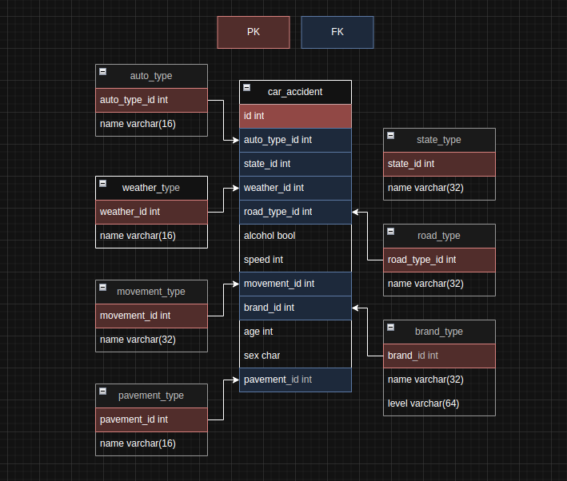

# Autonomous Analysis

## Table of Contents
- [Topic Background](#topic-background)
- [Data Analysis Strategy](#data-analysis-strategy)
- [USA Data Analysis]()
   
   
   
  
## 🚘 Topic Background
- " 자율주행의 시대가 다가오는 요즘, 급발진, 음주운전, 졸음운전등의 사고문제가 자율주행으로 해결될 수 있을까? "  
  궁금증으로부터 저희의 프로젝트가 시작되었습니다.
   
   

## Data Analysis Strategy
### 📌 Scope Limitation 
To streamline our analysis, we defined the scope as follows:
- **South Korea:** Seoul  
- **United States:** San Francisco  
   

### 💡 ER Diagram
미국과 한국의 교통사고 데이터를 한 테이블에 저장 (car_accident)

 

**Column Descriptions**
- `auto_type_id`: auto or manaul
- `state_id`: Seoul or SF
- `weather_id`: 5 different weather type (clear, cloud, rain, snowy, other)
- `road_type_id`: intersection, high way, parking lot, other
- `movement_id`: movement at crash moment (turning, straight, back, etc)
- `brand_id`: autonomous car company name
- `pavement_id`: road codition type (dry, wet, icy, other)

   
   

## USA Data Analysis

  

    ▶️자율주행 <b>브랜드</b>별 사고건수 조사  
    Waymo, GM Cruise
  

  
   
   
  

     
     
    ▶️자율주행 <b>시스템</b>별 사고건수 조사  
    자율주행 차량 사고건수 내에서 탑재된 system 별로 사고량을 분석.      
  

  
  

      ☝️ 
      Level 2 ADAS가 가장 높음  
      ADS는 비교적 낮으며 두개 다 가지고 있는 차량이 가장 사고량이 적음  
      ADS의 안정화 예시: Waymo[Level 4, ADS] (2022년 이후로 안정되고 있는 중)
     
     
     
  

  

    ▶️자율주행 <b>도로유형</b>별 사고건수 조사  
    도로유형: 교차로, 기타, 주차장, 단일로      
  

  
  

     
     
    ▶️자율주행 <b>속도</b>별 사고건수 조사  
  

  
  

     
     
    ▶️자율주행 <b>속도 & 사고당시 상태</b>별 사고건수 조사  
    상태: 졸음, 음주, 주차, 유턴, 좌/우회전, 직진, 차로위반, 중앙선 침범
  

  
  

     
     
    ▶️샌프란시스코 <b>날씨</b>별 사고건수 조사  
    날씨: 맑음, 흐림, 비, 눈
  

  
   

     
     
    ▶️샌프란시스코 날씨에 따른 <b>상대적 위험도</b>  
  

  
  
  
  
    
   
   
   
   

## KR Data Analysis

  
  
  
  
  
  
  
  
   
   
   
   

## Conclusion

